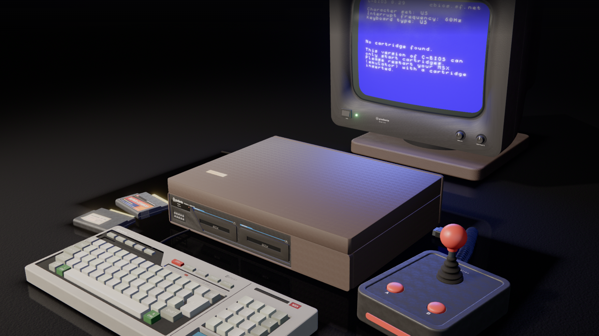

# Gradiente Expert XP-800 — Interactive 3D Replica

[](https://github.com/mneves75/msx-expert-xp800/actions/workflows/ci.yml)
[](LICENSE)

An interactive Three.js reconstruction of the **Gradiente Expert XP-800**, the Brazilian
MSX home computer released in December 1985. The scene combines a procedural,
product-photography-grade replica with a working MSX emulator on a period CRT.



**Live:** https://msx-expert-xp800.mvneves.workers.dev

Inspired by [ps1-pi.vercel.app](https://ps1-pi.vercel.app/); built from scratch.

## Highlights

- **Entirely procedural:** geometry, ABS grain, legends, wear, dust, and studio lighting
  are generated in code. There are no downloaded models, texture packs, or HDRIs; the
  project stays below 3 MB gzipped, excluding the runtime-loaded emulator.
- **Authentic hardware:** a hi-fi-style console, detached 89-key keyboard with `Ç`,
  ~15-inch CRT, joystick, cartridges, and the XP-800's real slot-cover soft reset.
- **Cartridge-aware emulation:** empty slots use a built-in TMS9918 BASIC screen. Inserting
  a cartridge loads WebMSX with C-BIOS from a commit-pinned, SRI-verified CDN URL; ejecting
  the last cartridge returns to BASIC. No proprietary BIOS is shipped.
- **Playable original software:** the red **Super Cósmico** cartridge contains an
  authorial Z80 space-snake game. **Carregar ROM…** runs a user-owned `.rom` file in the
  black cartridge; its bytes remain in browser memory and are never uploaded.
- **CRT simulation:** curved glass, phosphor mask, scanlines, persistence, composite
  artifacts, halation, studio reflections, warm-up, shutdown decay, and emitted light.
- **Measured interaction and rendering:** press individual 3D keys, use the physical
  keyboard, steer with the joystick, insert cartridges, and inspect wireframe or X-ray
  views. The settled scene renders on demand instead of presenting identical frames.

## Controls

| Action | Input |
|---|---|
| Orbit / pan / zoom | Drag / right-drag / scroll; touch is supported |
| Power | Click the switch or press `Alt+L` |
| Soft reset | Push a slot cover or press `Alt+R` |
| Cartridge A / B | Click a slot or press `Alt+A` / `Alt+B` |
| MSX input | Click 3D keys or use the physical keyboard |
| Joystick | Drag the stick; hold button A for fire/Space |
| Wireframe / X-ray | `Alt+W` / `Alt+X` |
| Reset view / auto-rotate | `Alt+V` / `Alt+G` |

The product UI is intentionally Brazilian Portuguese.

## Development

Requirements: Node 22 or newer and pnpm 11. Run Wrangler under Node, never Bun.

```bash
pnpm install
pnpm dev          # http://localhost:5173
pnpm verify       # ast-grep + TypeScript
pnpm build        # production build in dist/
pnpm deploy       # build + Cloudflare Workers deployment
```

## Verification

Start `pnpm dev`, then choose the tool that answers the question being tested:

```bash
node tools/shoot.mjs                   # 15 camera poses and lit-subject gate
node tools/verify-interactions2.mjs   # power, cartridges, HUD, and interaction state
node tools/verify-keymap.mjs          # modeled keys against both screen sources
node tools/tune-exposure.mjs          # measured keycap RGB against the spec
node tools/profile.mjs --label base   # frames, passes, draw calls, and CPU profile
node tools/probe-game.mjs             # plays Super Cósmico on real WebMSX
node tools/verify-prod.mjs <url>       # deployed headers, emulator, and cartridge flow
```

See [`AGENTS.md`](AGENTS.md) for the complete trigger table. Open visual captures and
compare them with `reference/raw/`; a generated image that nobody inspected is not proof.

## Deploying your own

`pnpm build` produces a fully static `dist/` — no server code, no database, no secrets —
so a fork deploys to any static host (Cloudflare, Netlify, GitHub Pages, S3, nginx…).

- **Cloudflare Workers Static Assets** is the zero-config path: the included
  [`wrangler.jsonc`](wrangler.jsonc) carries no account-specific values, so
  `pnpm deploy` publishes to whichever Cloudflare account your Wrangler is logged into.
- **Other hosts:** serve `dist/` with SPA fallback and replicate the security and cache
  headers from [`public/_headers`](public/_headers) (Cloudflare and Netlify read that
  file natively; elsewhere, port the CSP to your host's header mechanism).
- Verify a deployment with `node tools/verify-prod.mjs https://your-deploy.example/`.

## Architecture

```text
src/
  core/         Engine, CameraRig, MaterialLibrary, Lighting, PostFX, adaptive quality
  models/       One SceneModule per physical object
  emulator/     WebMSX bridge, procedural screen, Z80 game, CRT shaders, key map
  interaction/  Picking, spring/damper physics, and interaction state
  ui/           Accessible Brazilian Portuguese HUD
  textures/     Seeded procedural texture generators
```

`Engine` composes modules through the contracts in `src/core/types.ts`. Modules never
import each other; each owns and disposes its GPU resources. When every module and the
camera report that they are settled, `Engine` skips presentation until an interaction or
explicit `requestRender()` invalidates the frame.

Cloudflare Workers serves `dist/` as static assets with no Worker script. Security and
cache headers live in `public/_headers`; its jsDelivr allowance exists only for the
commit-pinned WebMSX hotlink and must stay aligned with that URL and SRI value.

## Documentation

| Document | Purpose |
|---|---|
| [`AGENTS.md`](AGENTS.md) | Working contract, invariants, and verification triggers |
| [`docs/SPEC.md`](docs/SPEC.md) | Dimensions, materials, calibrations, and behavior |
| [`FOR_YOU_KNOW.md`](FOR_YOU_KNOW.md) | Architecture and lessons behind the design |
| [`CHANGELOG.md`](CHANGELOG.md) | Current release summary |
| [`SECURITY.md`](SECURITY.md) | Supported version and private reporting |
| [`reference/raw/CREDITS.md`](reference/raw/CREDITS.md) | Photograph provenance and licenses |

## License and credits

- Repository code: [MIT](LICENSE). Third-party components are listed in
  [`THIRD_PARTY_NOTICES.md`](THIRD_PARTY_NOTICES.md).
- [WebMSX](https://github.com/ppeccin/WebMSX) by Paulo Augusto Peccin loads at runtime
  and is never redistributed because its repository declares no license.
- [C-BIOS](https://cbios.sourceforge.net/) provides the open BIOS; no proprietary MSX ROM
  is shipped.
- Reference photographs come from the [MSX Wiki](https://www.msx.org/wiki/Gradiente_Expert_XP-800).
  Only CC BY 3.0 images are committed; see `reference/raw/CREDITS.md`.
- MSX, Gradiente, and Expert are trademarks of their respective owners. This project is
  an unofficial tribute.
